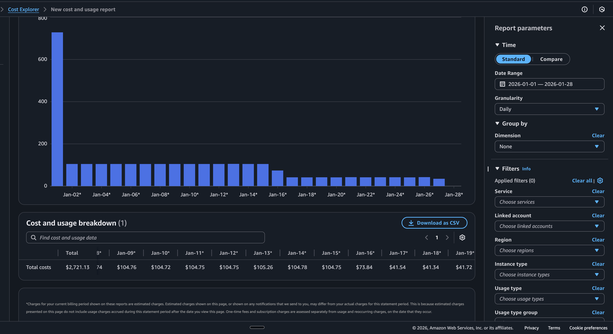
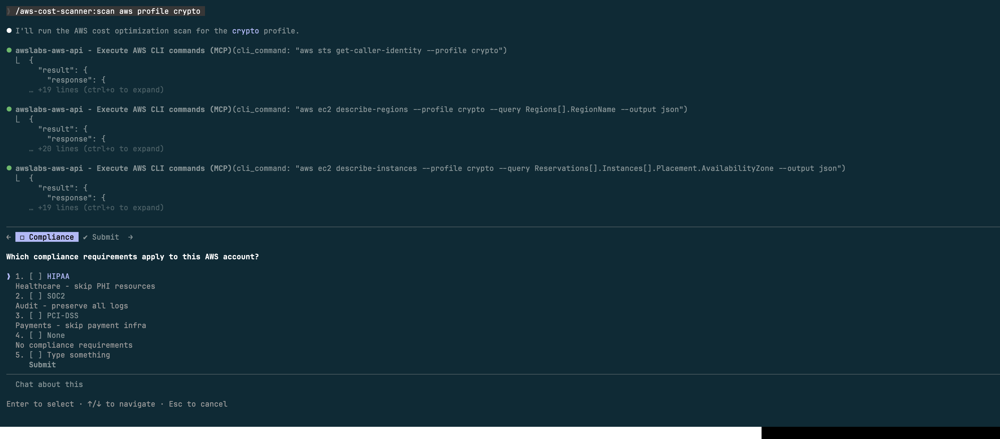
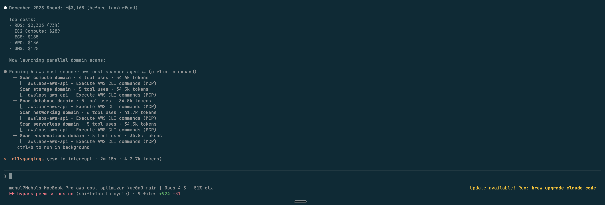

# AWS Cost Scanner

Find what's wasting money in your AWS account.

```
You: "Scan my AWS for cost savings"
Claude: Found 8 issues. Potential savings: $340/month
```

A Claude Code plugin that scans EC2, RDS, S3, Lambda, ECS, EKS, Aurora, SageMaker, Kinesis, and 30+ more AWS services.


*Real AWS account: $105/day → $42/day after running the scanner*

### How it works

**Step 1:** Choose compliance requirements



**Step 2:** 6 parallel agents scan your account



## Prerequisites

Before installing this plugin, you need:

### 1. Install `uv` (Python package manager)

```bash
# macOS/Linux
curl -LsSf https://astral.sh/uv/install.sh | sh

# Windows
powershell -ExecutionPolicy ByPass -c "irm https://astral.sh/uv/install.ps1 | iex"
```

### 2. Configure AWS Credentials

The plugin needs AWS credentials with read access. Choose one method:

**Option A: AWS SSO (Recommended)**
```bash
aws configure sso
aws sso login --profile your-profile
```

**Option B: Access Keys**
```bash
aws configure
# Enter your AWS Access Key ID and Secret Access Key
```

**Option C: Environment Variables**
```bash
export AWS_ACCESS_KEY_ID=your-key
export AWS_SECRET_ACCESS_KEY=your-secret
export AWS_REGION=us-east-1
```

### 3. Required AWS Permissions

**This tool only reads data — it never modifies or deletes anything.**

Your AWS credentials need read access to:
- EC2 (instances, volumes, snapshots, EIPs)
- RDS, Aurora, DocumentDB, Neptune (instances, clusters)
- S3 (buckets, lifecycle)
- Lambda (functions)
- CloudWatch (logs, metrics)
- Cost Explorer (cost and usage data)
- ElastiCache, EFS, DynamoDB
- ECS, EKS (clusters, services, tasks)
- Redshift, OpenSearch (clusters, domains)
- SageMaker (notebooks, endpoints)
- Kinesis, MSK, Glue, EventBridge
- FSx, AWS Backup

Recommended: Use the `ReadOnlyAccess` managed policy or create a custom policy.

## Installation

In Claude Code:

```
/plugin → Marketplaces → Add Marketplace → git@github.com:prajapatimehul/aws-cost-scanner.git
```

Select `aws-cost-scanner` and install. That's it.

## Quick Start

After installation:

```bash
# Start the scan workflow
/aws-cost-scanner:scan

# Or ask directly
Scan my AWS account for cost optimization opportunities
```

## Features

- **Parallel scanning** - 11 domain agents run simultaneously
- **163 checks** across compute, storage, database, networking, serverless, reservations, containers, analytics, and more
- **Confidence scoring** - filters false positives automatically
- **Real pricing** - uses AWS Cost Explorer for accurate spend data
- **Markdown reports** - clean, actionable output

## Domains & Checks

| Domain | Checks | Key Areas |
|--------|--------|-----------|
| **Compute** | 25 | EC2 idle/over-provisioned, EBS unattached, GP2→GP3 |
| **Storage** | 22 | S3 lifecycle, CloudWatch Logs retention, snapshots |
| **Database** | 15 | RDS idle/over-provisioned, RI coverage |
| **Networking** | 15 | Unused EIPs, NAT optimization, VPC endpoints |
| **Serverless** | 10 | Lambda memory, unused functions |
| **Reservations** | 10 | RI/Savings Plans coverage gaps |
| **Containers** | 15 | ECS/EKS idle, Fargate optimization, Spot |
| **Advanced DBs** | 18 | Aurora, DocumentDB, Neptune, Redshift |
| **Analytics** | 15 | SageMaker, EMR, OpenSearch, QuickSight |
| **Data Pipelines** | 12 | Kinesis, MSK, Glue, EventBridge |
| **Storage Advanced** | 6 | FSx, AWS Backup optimization |

## Commands & Skills

| Command | Description |
|---------|-------------|
| `/aws-cost-scanner:scan` | Run the full 8-step cost optimization workflow |
| `/aws-cost-scanner:reviewing-findings` | Review findings with confidence scoring |
| `/aws-cost-scanner:validating-aws-pricing` | Validate pricing against AWS Pricing API |

## Output

Generates:
- `findings.json` - Machine-readable findings
- `reports/cost_report_{profile}.md` - Human-readable report

## Troubleshooting

### "MCP server not found"
Make sure `uv` is installed and in your PATH:
```bash
uv --version
```

### "AWS credentials not configured"
Verify your credentials:
```bash
aws sts get-caller-identity
```

### "Access Denied" errors
Check that your AWS credentials have the required read permissions.

## License

MIT
