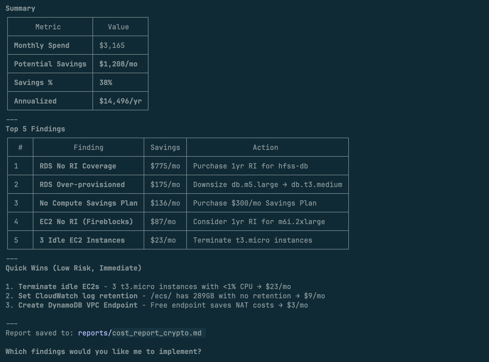

# AWS Cost Saver

[](https://github.com/prajapatimehul/aws-cost-saver/stargazers)
[](https://opensource.org/licenses/MIT)
[](https://github.com/prajapatimehul/aws-cost-saver/releases)
[](https://github.com/prajapatimehul/aws-cost-saver/pulls)
[](https://code.claude.com)

Find what's wasting money in your AWS account.

```
You: "Scan my AWS for cost savings"
Claude: Found 8 issues. Potential savings: $340/month
```

## Installation

In Claude Code:

```
/plugin → Marketplaces → Add Marketplace → git@github.com:prajapatimehul/aws-cost-saver.git
```

Select `aws-cost-saver` and install.

## Quick Start

```bash
/aws-cost-saver:scan
```

Or just ask: `Scan my AWS account for cost savings`

**Requirements:** AWS credentials configured (`aws configure` or SSO), `uv` installed.

**This tool only reads data — it never modifies or deletes anything.**

## Features

- **163 checks** across EC2, RDS, S3, Lambda, ECS, EKS, Aurora, SageMaker, and 30+ services
- **Parallel scanning** - 11 domain agents run simultaneously
- **Confidence scoring** - filters false positives
- **Real pricing** - uses AWS Cost Explorer
- **Markdown reports** - clean, actionable output

## Commands

| Command | Description |
|---------|-------------|
| `/aws-cost-saver:scan` | Full cost optimization scan |
| `/aws-cost-saver:reviewing-findings` | Review with confidence scoring |
| `/aws-cost-saver:validating-aws-pricing` | Validate against AWS Pricing API |

---

## Demo

### Results



### Before & After


*Real AWS account: $105/day → $42/day after running the scanner*

### How it works

**Step 1:** Choose compliance requirements


**Step 2:** Parallel agents scan your account


---

## Domains & Checks

| Domain | Checks | Key Areas |
|--------|--------|-----------|
| **Compute** | 25 | EC2 idle/over-provisioned, EBS, GP2→GP3 |
| **Storage** | 22 | S3 lifecycle, CloudWatch Logs, snapshots |
| **Database** | 15 | RDS idle/over-provisioned, RI coverage |
| **Networking** | 15 | Unused EIPs, NAT, VPC endpoints |
| **Serverless** | 10 | Lambda memory, unused functions |
| **Reservations** | 10 | RI/Savings Plans coverage |
| **Containers** | 15 | ECS/EKS idle, Fargate, Spot |
| **Advanced DBs** | 18 | Aurora, DocumentDB, Neptune, Redshift |
| **Analytics** | 15 | SageMaker, EMR, OpenSearch |
| **Data Pipelines** | 12 | Kinesis, MSK, Glue |
| **Storage Advanced** | 6 | FSx, AWS Backup |

## Troubleshooting

**"MCP server not found"** — Install `uv`: `curl -LsSf https://astral.sh/uv/install.sh | sh`

**"AWS credentials not configured"** — Run `aws configure` or `aws sso login`

**"Access Denied"** — Use `ReadOnlyAccess` policy or check permissions

## License

MIT
